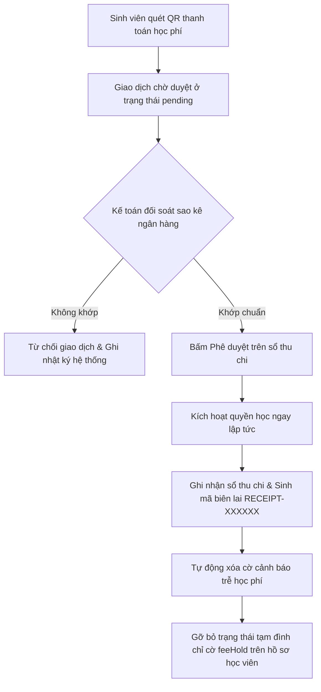

# TÀI LIỆU YÊU CẦU NGHIỆP VỤ HỢP NHẤT (MASTER BUSINESS REQUIREMENTS DOCUMENT)
## HỆ THỐNG QUẢN LÝ ĐÀO TẠO E16 LMS (PRODUCTION VERSION 1.2)
*Hợp nhất Tiêu chuẩn BRD v1.1 (2026-05-22) và các Cải tiến Thực tế Hệ thống (2026-05-29)*

---

## 1. TÓM TẮT ĐIỀU HÀNH (EXECUTIVE SUMMARY)
**E16 LMS** là nền tảng quản lý học tập (Learning Management System) doanh nghiệp được thiết kế tối ưu hóa cho các cơ sở giáo dục, trường học và trung tâm đào tạo chuyên nghiệp. 

Hệ thống kế thừa cấu trúc phân quyền cốt lõi của phiên bản **BRD v1.1** và được nâng cấp lên **phiên bản 1.2** nhằm phản ánh đầy đủ các cải tiến thực tế trên môi trường production, bao gồm sự bổ sung của vai trò **Phụ huynh (Parent)**, **Cố vấn học tập (Advisor)** và hệ thống quản trị chuyên cần độc lập.

**Quy tắc xác thực cốt lõi**:
- Tài khoản người dùng **không được tự đăng ký** trên môi trường production. Mọi tài khoản phải được khởi tạo bởi **Admin** (hàng loạt qua CSV) hoặc **Lễ tân** (từng học sinh).
- Quyền học của Sinh viên chỉ được kích hoạt sau khi **Kế toán** phê duyệt giao dịch thanh toán học phí hợp lệ trên sổ thu chi.

---

## 2. MỤC TIÊU KINH DOANH (BUSINESS OBJECTIVES)
1. Cung cấp nền tảng quản trị đào tạo ổn định, có khả năng sao lưu, khôi phục và bảo mật cao cấp trên dữ liệu thật.
2. Tự động hóa tối đa các quy trình vận hành: tạo tài khoản, gửi mail kích hoạt, điểm danh, chấm quiz trắc nghiệm, khóa/mở bài tập, tự động cấp chứng chỉ và quản lý sổ thu chi kế toán.
3. Hỗ trợ sự đồng hành của **Phụ huynh** và **Cố vấn học tập** để giảm tỉ lệ sinh viên bỏ học thông qua cơ chế cảnh báo sớm tự động.

---

## 3. PHẠM VI SẢN PHẨM (PRODUCT SCOPE)

### 3.1. Trong phạm vi hoạt động (In-Scope - Phiên bản 1.2)
* **Xác thực & Bảo mật**: Đăng nhập email/mật khẩu bảo vệ CSRF; cơ chế Link kích hoạt (24 giờ, dùng 1 lần) và Link reset mật khẩu (1 giờ, dùng 1 lần); quản lý phiên làm việc active.
* **Phân quyền 8 vai trò chính**: Admin, Giảng viên (Teacher), Học viên (Student), Kế Toán (Finance), Lễ Tân (Receptionist), Quản Lý Học Vụ (Academic Admin), Phụ huynh (Parent) [Cải tiến], Cố vấn học tập (Advisor) [Cải tiến].
* **Vòng đời khóa học**: Quy trình duyệt khóa học nghiêm ngặt (Nháp $\rightarrow$ Gửi duyệt $\rightarrow$ Duyệt/Từ chối có lý do từ Admin).
* **Đánh giá học thuật**:
  - Quiz tự động chấm điểm (Một đáp án, nhiều đáp án, điền từ tự do) có bộ đếm ngược tự động khóa đề khi hết giờ.
  - Bài tập tự luận (Assignments) hỗ trợ nộp văn bản hoặc tệp tin đính kèm; bộ lọc Regex chống phình to văn bản; visual emerald giữ tệp cũ thông minh.
* **Chuyên cần & Điểm danh độc lập [Cải tiến]**: Chuyển giao quyền điểm danh hoàn toàn sang cho **Học vụ**. Học vụ quét sự tuân thủ điểm danh của giảng viên và chốt danh sách chuyên cần.
* **Cảnh báo học tập tự động [Cải tiến]**: Hệ thống tự động quét và phát cảnh báo học tập đỏ (chuyên cần dưới 80%, trễ hạn học phí) gửi thẳng tới học viên và phụ huynh.
* **Tài chính & Sổ thu chi**: Phát nợ học phí tự động; Student thanh toán QR ngân hàng; Kế toán đối chiếu sao kê và phê duyệt giao dịch kích hoạt khóa học tự động.
* **Học bạ & Chứng chỉ**: Bảng điểm thành phần chi tiết (30% tự luận + 70% trắc nghiệm); cấp chứng chỉ tự động; trang xác thực chứng chỉ công khai bảo vệ quyền riêng tư học viên.
* **Cấp phát Email tự động [Mới]**: Tự động cấp phát tài khoản email trường thật trên Google Workspace (`username@SCHOOL_DOMAIN`) cho sinh viên mới; tự động thu hồi/xóa email khi deactive tài khoản; định tuyến toàn bộ thông báo hệ thống về hòm thư trường học.

### 3.2. Ngoài phạm vi hoạt động (Out-of-Scope)
* Lớp học trực tuyến tương tác realtime (Zoom/Meet integration).
* Ứng dụng di động Native (App iOS/Android).
* Trợ lý ảo AI chấm bài tự động.

---

## 4. STAKEHOLDERS (CÁC BÊN LIÊN QUAN)
* **Chủ sản phẩm (Product Owner)**: Định hướng roadmap, phê duyệt điều kiện nghiệm thu.
* **Dev / DevOps**: Triển khai hệ thống, tối ưu hóa P95 load time, thiết lập sao lưu tự động hàng ngày và chính sách rollback.
* **Đội ngũ Vận hành (Admin, Học vụ, Lễ tân, Kế toán, Cố vấn)**: Thực thi công tác nghiệp vụ đào tạo và quản trị tài chính hàng ngày.
* **Người dùng cuối (Student, Parent, Teacher)**: Đối tượng thụ hưởng dịch vụ học tập và tương tác đào tạo.

---

## 5. PERSONA & NHU CẦU NGHIỆP VỤ CHI TIẾT

### 5.1. Kế Toán (Finance)
Chịu trách nhiệm đối soát tài chính, ngăn chặn thất thoát và phê duyệt kích hoạt quyền học của sinh viên.
- **Nhu cầu cốt lõi**:
  - Dashboard tổng doanh thu thực tế, số giao dịch chờ đối soát, biểu đồ xu hướng 30 ngày.
  - Phê duyệt/từ chối giao dịch chuyển khoản (Student quét QR); tự động kích hoạt quyền học và đồng bộ cờ cảnh báo nợ khi duyệt.
  - Quản lý sổ thu chi chi tiết và export báo cáo doanh thu CSV.
  - **Quy tắc chặn**: Không có quyền can thiệp vào điểm số, bài học hoặc hồ sơ cá nhân của người dùng.

### 5.2. Lễ Tân (Receptionist)
Hỗ trợ onboarding học viên offline và xử lý các sự cố tài khoản ban đầu.
- **Nhu cầu cốt lõi**:
  - Khởi tạo tài khoản học viên mới (gắn role Student mặc định) và gửi link kích hoạt 24h.
  - Kích hoạt gửi link đặt lại mật khẩu hộ học viên và tra cứu thông tin nhanh dưới 1 giây.
  - Tra cứu danh sách môn học đang mở để tư vấn.
  - **Quy tắc chặn**: Không có quyền sửa đổi điểm số, nội dung khóa học hay cấu hình hệ thống.

### 5.3. Quản Lý Học Vụ (Academic Admin)
Giám sát chất lượng đào tạo, chuyên cần toàn hệ thống và thực thi chế tài cảnh báo học thuật.
- **Nhu cầu cốt lõi**:
  - Quản lý buổi điểm danh lớp học, chốt danh sách chuyên cần thay cho giảng viên.
  - Giám sát sự tuân thủ điểm danh của giảng viên phụ trách môn và gửi email cảnh cáo kỷ luật.
  - Quản trị danh sách Cảnh báo học tập (Academic Warnings) đối với sinh viên có chuyên cần dưới 80% hoặc nợ học phí quá hạn.
  - Xem dashboard tổng hợp đào tạo, so sánh hiệu quả và tỉ lệ bỏ dở bài học.
  - **Quy tắc chặn**: Không có quyền chỉnh sửa nội dung bài giảng của giảng viên.

### 5.4. Phụ huynh (Parent) [Cải tiến bổ sung]
Đồng hành, giám sát chuyên cần và nghĩa vụ tài chính của sinh viên.
- **Nhu cầu cốt lõi**:
  - Xem bảng điểm chi tiết thành phần thực tế (30% Tự luận lý thuyết, 70% Trắc nghiệm thực hành) cùng điểm tổng kết môn bôi màu trực quan thay vì hiển thị dữ liệu tĩnh (mock).
  - Giám sát chuyên cần thực tế hàng tuần của con và xem học lực phân loại tự động.
  - Theo dõi cờ cảnh báo học thuật (Cảnh báo chuyên cần, cảnh báo trễ học phí) để kịp thời đôn đốc.

### 5.5. Cố Vấn Học Tập (Advisor) [Cải tiến bổ sung]
Hỗ trợ sâu sát học vụ và đưa ra biện pháp cải thiện học lực cho sinh viên được phân công.
- **Nhu cầu cốt lõi**:
  - Quản lý chi tiết học bạ, cảnh báo đỏ của lớp phụ trách.
  - Soạn thảo Ghi chú cố vấn học tập (Advisor Notes) định kỳ để gửi cho nhà trường và phụ huynh phối hợp giải quyết.

---

## 6. QUY TRÌNH NGHIỆP VỤ & WORKFLOWS (CHI TIẾT CHUẨN HOÁ)

### 6.1. Quy trình Điểm danh Chuyên cần độc lập (Học vụ)
```mermaid
graph TD
    A[Học vụ kiểm tra dashboard tuân thủ] --> B{Phát hiện môn chưa điểm danh?}
    B -- Có --> C[Bấm "Bắn mail Cảnh cáo" gửi tới Giảng viên]
    B -- Không --> D[Tiếp tục giám sát]
    C --> E[Học vụ chọn lớp phần và bấm "Bắt đầu buổi học mới"]
    E --> F[Điền ngày học, giờ học và đề tài bài dạy]
    F --> G[Hệ thống tạo sẵn danh sách sinh viên]
    G --> H[Học vụ tích chọn trạng thái chuyên cần cho từng SV]
    H --> I[Chốt lưu dữ liệu chuyên cần thực tế vào DB]
```

### 6.2. Quy trình Ghi thu Học phí & Đồng bộ Chống đè dữ liệu


---

## 7. YÊU CẦU CHỨC NĂNG & TIÊU CHÍ NGHIỆM THU (FUNCTIONAL REQUIREMENTS)

### 7.1. Xác thực và Phân quyền (Authentication & Authorization)
* **AUTH-001 [Must]**: Không có trang tự đăng ký công khai. Toàn bộ tài khoản do Admin hoặc Lễ tân tạo qua console quản trị.
* **AUTH-002 [Must]**: Đăng nhập bằng email/mật khẩu. Nhập sai trả thông báo lỗi chung chung (không tiết lộ sự tồn tại của email).
* **AUTH-003 [Must]**: Tài khoản bị khóa (trạng thái `isActive = false`) phải bị chặn đăng nhập ngay lập tức.
* **AUTH-004 [Must]**: Link kích hoạt tài khoản có hiệu lực trong 24 giờ. Link reset mật khẩu có hiệu lực trong 1 giờ. Cả hai link chỉ sử dụng được 1 lần duy nhất.
* **AUTH-005 [Must]**: Sau khi đổi hoặc reset mật khẩu thành công, toàn bộ phiên làm việc (sessions) active trên các thiết bị khác phải bị vô hiệu hóa bắt buộc.
* **AUTH-006 [Must]**: Bảo vệ chống tấn công CSRF trên toàn bộ các form chỉnh sửa/ghi dữ liệu.

### 7.2. Quản trị hệ thống (Admin)
* **ADM-001 [Must]**: Xem danh sách người dùng đầy đủ, sắp xếp theo tài khoản mới nhất lên trước.
* **ADM-002 [Must]**: Admin import danh sách người dùng bằng tệp CSV (tối đa 5MB, tối đa 5000 dòng). Các dòng lỗi bị bỏ qua và ghi log lỗi chi tiết, không dừng toàn bộ tiến trình import của các dòng hợp lệ.
* **ADM-003 [Must]**: Admin không thể tự đổi vai trò, tự khóa hoặc tự xóa tài khoản của chính mình.
* **ADM-004 [Must]**: Tự động ghi nhật ký hệ thống (Audit Logs) cho tất cả các thao tác nhạy cảm của Admin, Lễ tân và Kế toán.

### 7.3. Đánh giá Học thuật & Chấm điểm (Teacher & Student)
* **TCH-001 [Must]**: Mỗi khóa học phải có ít nhất một bài học (Lesson) mới được quyền gửi duyệt xuất bản lên Admin.
* **TCH-002 [Must]**: Điểm thi trắc nghiệm (Quizzes) tự động chấm điểm và hỗ trợ 3 loại câu hỏi: Một đáp án, nhiều đáp án, điền từ tự do.
* **TCH-003 [Must]**: Bài trắc nghiệm có giới hạn thời gian phải tự động nộp bài ngay khi bộ đếm ngược về 0.
* **TCH-004 [Must]**: Nộp bài tập tự luận (Assignments) hỗ trợ nộp văn bản gốc hoặc đính kèm tệp tin. Hệ thống tự động làm sạch chuỗi đính kèm cũ bằng Regex để tránh phình to văn bản bài làm khi SV cập nhật bài nộp nhiều lần.
* **TCH-005 [Must]**: [Cải tiến UI/UX] Khi chấm điểm bài tập tự luận hoặc cập nhật thông tin khóa học, toàn bộ modal popup phải render qua `ModalPortal.tsx` để căn giữa Viewport hoàn hảo, chống lỗi Containing Block của CSS làm modal lệch vị trí khi cuộn trang.

### 7.4. Tài chính và Ghi thu (Kế toán)
* **KTO-001 [Must]**: Kế toán duyệt giao dịch quét QR ngân hàng thành công phải tự động kích hoạt quyền học và gỡ bỏ trạng thái khóa hồ sơ (`feeHold = false`) ngay lập tức mà không cần can thiệp thủ công.
* **KTO-002 [Must]**: Giao dịch đã phê duyệt hoặc từ chối thành công không được phép xử lý lại lần hai để bảo toàn tính nhất quán của sổ thu chi.
* **KTO-003 [Must]**: [Cải tiến An toàn Kế toán] Cấu hình hệ thống loại trừ đồng bộ ngược (chống ghi đè từ client-side) đối với các bảng tài chính cốt lõi: `tuition_fees`, `transactions`, `academic_warnings`, và `enrollments` để ngăn ngừa tuyệt đối lỗi đè dữ liệu kế toán cũ lên database.

### 7.5. Chuyên cần và Cảnh báo Học tập (Học vụ)
* **QLV-001 [Must]**: Quyền điểm danh và chỉnh sửa chuyên cần thuộc về cán bộ **Học vụ**. Cấm hoàn toàn vai trò giảng viên hoặc sinh viên tự ý ghi nhận chuyên cần trực tiếp.
* **QLV-002 [Must]**: Hệ thống tự động phát cờ cảnh báo đỏ nếu tỉ lệ chuyên cần thực tế của sinh viên tại một lớp học phần dưới mốc **80%**.
* **QLV-003 [Must]**: Tự động gỡ bỏ cờ cảnh báo nợ học phí quá hạn của sinh viên khi hóa đơn học phí tương ứng được chuyển sang trạng thái đã nộp đủ (`paid`).

### 7.6. Cấp phát Email tự động (Google Workspace Provisioning) [Mới]
* **PROV-001 [Must]**: Tự động khởi tạo tài khoản email thật trên Google Workspace với phần mở rộng tên miền của trường (`SCHOOL_EMAIL_DOMAIN`) khi tài khoản sinh viên được tạo mới.
* **PROV-002 [Must]**: Quy tắc sinh tên đăng nhập (`username`): Sử dụng tên đầy đủ, loại bỏ hoàn toàn dấu tiếng Việt, chuyển thành chữ thường, phân tách bằng dấu chấm và đảo ngược các từ (ví dụ: "Nguyễn Văn Tiến" -> `tien.van.nguyen`).
* **PROV-003 [Must]**: Cơ chế xử lý trùng lặp: Nếu tên đăng nhập đề xuất đã tồn tại trên hệ thống Google hoặc cơ sở dữ liệu, tự động tăng chỉ số số đằng sau bắt đầu từ số 2 (ví dụ: `tien.van.nguyen2`, `tien.van.nguyen3`).
* **PROV-004 [Must]**: Gửi email chào mừng chứa thông tin đăng nhập email trường và mật khẩu tạm thời vào địa chỉ email cá nhân đăng ký ban đầu của sinh viên. Mật khẩu tạm thời không được lưu trữ dưới bất kỳ hình thức nào trong DB.
* **PROV-005 [Must]**: Khi vô hiệu hóa tài khoản sinh viên (`isActive = false`), tự động gửi yêu cầu thu hồi/xóa tài khoản email trường tương ứng trên Google Workspace và xóa trắng dữ liệu hòm thư trường trong database để có thể tái cấp phát nếu cần.
* **PROV-006 [Must]**: Hỗ trợ Admin/Super Admin kích hoạt lại luồng cấp phát thủ công thông qua API `POST /api/admin/users/:id/reprovision-email` trong trường hợp cấp phát tự động bị gián đoạn.
* **PROV-007 [Must]**: Bảo vệ an toàn dữ liệu: Loại bỏ các trường `school_email`, `email_provisioned`, `email_provisioned_at` khỏi payload đồng bộ `syncClientStoreToDb` để ngăn chặn client ghi đè dữ liệu cũ.
* **PROV-008 [Must]**: Khi sinh viên đã được cấp phát email thành công, toàn bộ email thông báo học vụ tiếp theo (điểm số, khóa học, tài chính...) bắt buộc phải gửi tới email trường thay vì email cá nhân.

---

## 8. YÊU CẦU DỮ LIỆU & BẢO MẬT (DATA & PRIVACY REQUIREMENTS)

### 8.1. Quy tắc dữ liệu & Học thuật
- **Công thức điểm tổng kết động**:
  $$Điểm\ Tổng\ Kết = (Assignment\ Avg \times 30\%) + (Max\ Quiz\ Score \times 70\%)$$
- **Quy tắc xếp loại học lực**:
  - $\ge 90\%$: Học lực **Xuất sắc** (GPA 4.0).
  - $\ge 80\%$: Học lực **Giỏi** (GPA 3.0).
  - $\ge 70\%$: Học lực **Khá** (GPA 2.0).
  - $\ge 60\%$: Học lực **Trung bình** (GPA 1.0).
  - $< 60\%$: Học lực **Yếu / Không đạt** (Cần học lại).
- **Quy tắc cấp chứng chỉ**: Chứng chỉ tốt nghiệp chỉ được cấp tự động một lần duy nhất cho mỗi học viên hoàn thành 100% bài học và đạt điểm tối thiểu bài thi cuối khóa. Trang công khai xác thực chứng chỉ chỉ hiển thị thông tin tối thiểu (Họ tên ẩn danh, ngày cấp, mã chứng chỉ) và bị vô hiệu hóa ngay nếu tài khoản hoặc khóa học bị khóa.

### 8.2. Chính sách bảo mật thông tin & Xóa dữ liệu
- **Xóa tài khoản**: Xóa tài khoản mặc định là vô hiệu hóa trạng thái (`isActive = false`). Xóa hoàn toàn khỏi cơ sở dữ liệu chỉ được thực hiện theo quy trình kiểm soát nội bộ nghiêm ngặt có phê duyệt của PO.
- **Ẩn danh dữ liệu**: Tài khoản bị vô hiệu hóa phải được tự động ẩn danh thông tin cá nhân trên tất cả các màn hình hiển thị báo cáo.
- **Thời hạn lưu trữ dữ liệu pháp lý**:
  - Lịch sử học tập: Tối thiểu 24 tháng.
  - Lịch sử kiểm duyệt diễn đàn: Tối thiểu 12 tháng.
  - Sổ thu chi kế toán / Giao dịch tài chính: Tối thiểu 60 tháng (5 năm) theo luật kế toán hiện hành.

---

## 9. YÊU CẦU PHI CHỨC NĂNG (NON-FUNCTIONAL REQUIREMENTS)

* **Mã hóa truyền tải**: Toàn bộ lưu lượng mạng giữa người dùng và máy chủ bắt buộc phải mã hóa qua giao thức HTTPS bảo mật.
* **Thời gian đáp ứng (Latency)**:
  - Thời gian tải trang chính: $\le 800$ms ở mức P95.
  - Thời gian kết xuất và export báo cáo CSV dưới 10.000 dòng: $\le 5$ giây ở mức P95.
  - Thời gian gửi link kích hoạt/reset mật khẩu qua email: $\le 60$ giây ở mức P95.
* **Khả năng chịu tải (Capacity)**: Hệ thống đáp ứng tối thiểu 5.000 người dùng đăng ký, 500 người dùng hoạt động đồng thời và 1.000 khóa học hoạt động liên tục không trễ lag.
* **Độ khả dụng (Availability)**: Cam kết thời gian hoạt động ổn định tối thiểu 99.5% mỗi tháng. Cơ chế sao lưu tự động hàng ngày và chính sách khôi phục nhanh (Rollback) ngay khi phát hiện sự cố sau khi cập nhật phiên bản mới.

---

## 10. ĐIỀU KIỆN SẴN SÀNG PRODUCTION (READY FOR PRODUCTION)
1. Toàn bộ các yêu cầu **Must** quy định trong tài liệu BRD này đã được code và vượt qua các bài kiểm thử biên dịch thành công (`tsc --noEmit` trả về mã 0).
2. Xóa bỏ hoặc vô hiệu hóa hoàn toàn trang tự đăng ký tài khoản công khai trên production.
3. Luồng kế toán đối soát $\rightarrow$ phê duyệt $\rightarrow$ kích hoạt tự động $\rightarrow$ xóa cảnh báo học tập đã được kiểm thử đầu cuối (End-to-End) thành công tuyệt đối.
4. Giao diện modal hiển thị cân đối 100% tại trung tâm màn hình dưới mọi mức cuộn trang của người dùng.
5. Sổ thu chi kế toán và biểu đồ SVG thu học phí vận hành chuẩn xác, chống méo mó giao diện.
6. Toàn bộ tài liệu vận hành và chính sách rollback đã được cấu hình sẵn sàng bàn giao cho ban quản trị.
7. Luồng cấp phát tự động và thu hồi email Google Workspace thông qua Service Account hoạt động ổn định, vượt qua các kiểm thử E2E tích hợp.

---
*Tài liệu được phê duyệt chính thức cho giai đoạn Production.*
