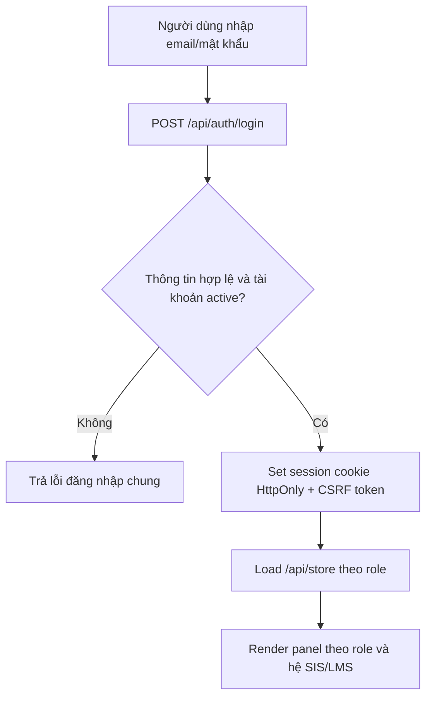
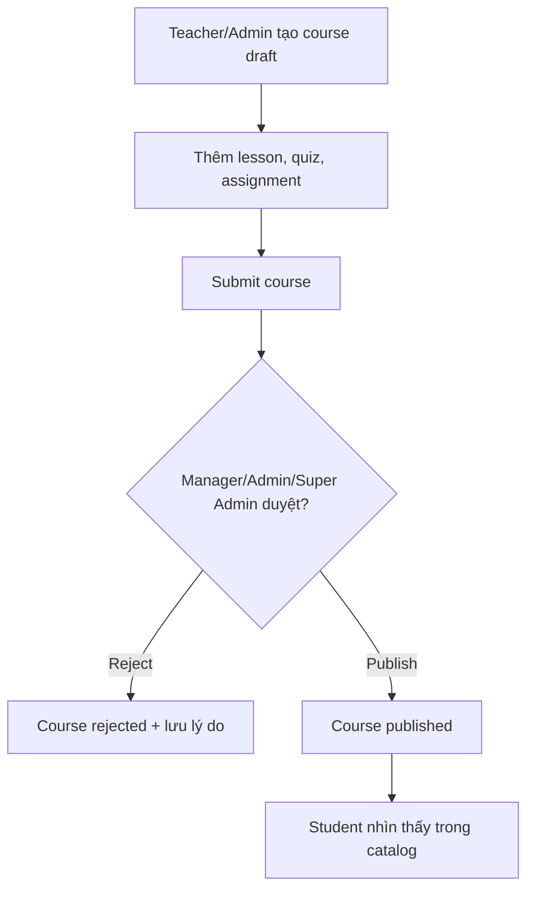
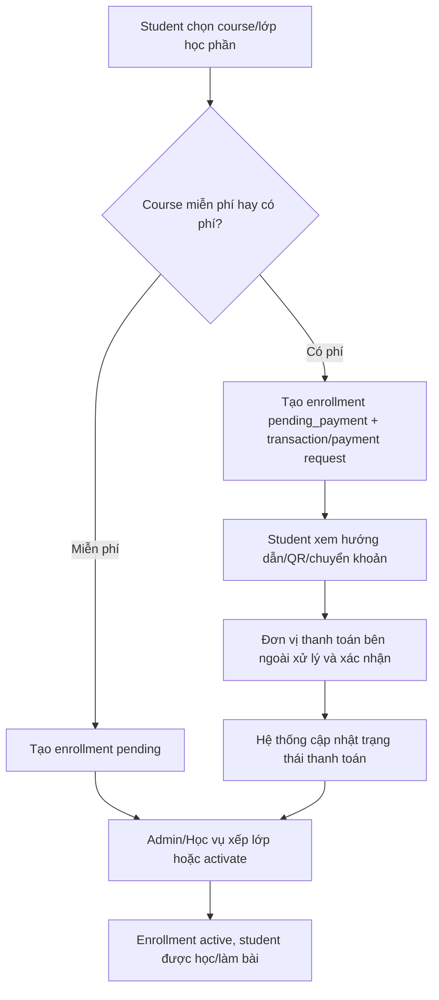
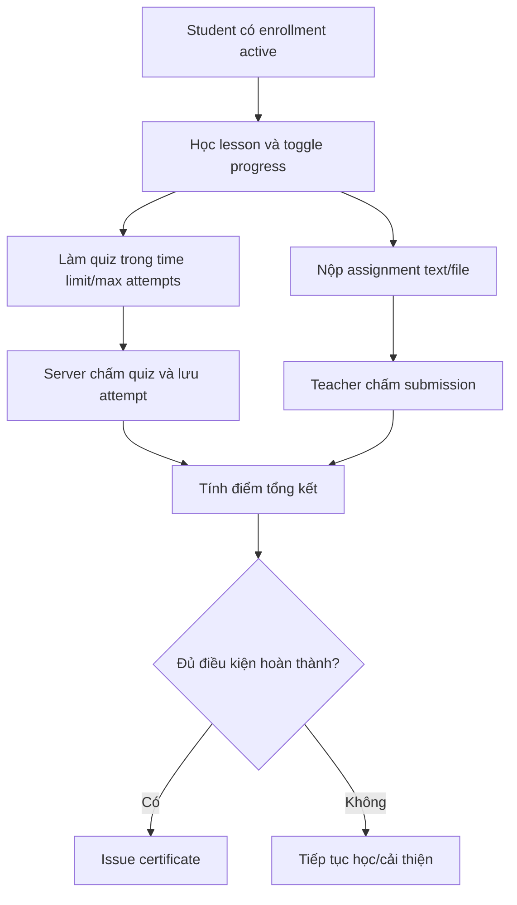
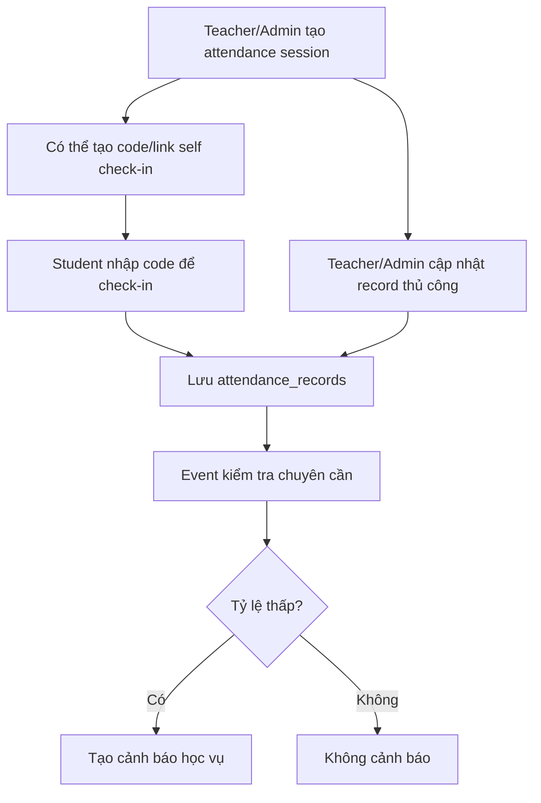
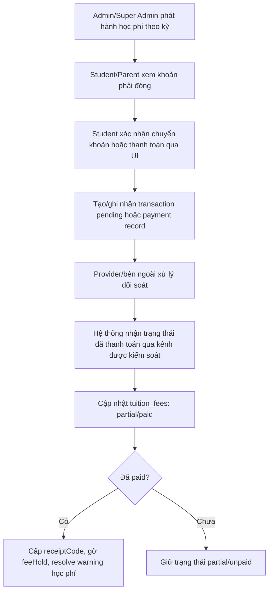

# Tài liệu yêu cầu nghiệp vụ E16 LMS/SIS

Phiên bản: 2.0
Ngày cập nhật: 2026-06-09
Phạm vi: Viết lại theo cấu trúc code hiện tại của repo `D:\LMS`

---

## 1. Tóm tắt điều hành

E16 LMS/SIS là ứng dụng quản lý đào tạo kết hợp hai không gian nghiệp vụ:

- **LMS Học tập**: quản lý khóa học, bài học, quiz, bài tập, sổ điểm, chứng nhận, diễn đàn, thông báo và trải nghiệm học tập của học viên.
- **Hành chính SIS**: quản lý hồ sơ sinh viên, học kỳ, ngành/khoa/chương trình đào tạo, lớp học phần, thời khóa biểu, chuyên cần, cảnh báo học vụ, học phí, học bổng, phúc khảo điểm, bảo lưu và xét tốt nghiệp.

Ứng dụng hiện là React SPA chạy cùng Express backend. PostgreSQL là nguồn dữ liệu chính; Redis được dùng cho cache/rate-limit khi cấu hình sẵn; Google Workspace được tích hợp để cấp phát email trường cho sinh viên.

Quy tắc scope quan trọng:

- Không có tự đăng ký tài khoản công khai. Tài khoản được tạo bởi người có quyền quản trị.
- Hệ thống chỉ còn **giao diện và trạng thái thanh toán**. Đối soát kế toán, sổ sách kế toán và phê duyệt giao dịch bởi kế toán nội bộ đã chuyển cho đơn vị/bên xử lý bên ngoài.
- Các vai trò nghiệp vụ cũ như `finance`, `sale`, `academic_admin`, `advisor` đã được chuẩn hóa vào 6 vai trò hệ thống hiện tại.

---

## 2. Mục tiêu sản phẩm

1. Cung cấp một nền tảng đào tạo có đủ luồng học tập, học vụ, hồ sơ sinh viên và giám sát phụ huynh.
2. Tách rõ trách nhiệm giữa hệ thống học vụ và đơn vị xử lý thanh toán bên ngoài.
3. Đảm bảo các quyền học chỉ được mở khi trạng thái học phí/thanh toán hợp lệ.
4. Tự động hóa các tác vụ lặp lại: cấp phát email trường, thông báo, chấm quiz, cập nhật điểm tổng kết, chuyên cần, cảnh báo học vụ và cấp chứng nhận.
5. Duy trì kiến trúc dễ vận hành: migration PostgreSQL, seed dữ liệu mẫu, lint/build, smoke test và rollback checklist.

---

## 3. Cấu trúc hệ thống theo code

### 3.1. Frontend

- `src/App.tsx`: shell đăng nhập, session, đổi mật khẩu, switch hệ thống SIS/LMS và điều hướng theo role.
- `src/components/AdminPanel.tsx`: phân hệ quản trị/học vụ dành cho `manager`, `admin`, `super_admin`.
- `src/components/TeacherPanel.tsx`: phân hệ giảng viên, lớp học, sổ điểm, thời khóa biểu, cố vấn.
- `src/components/StudentPanel.tsx`: phân hệ học viên, catalog, học tập, học vụ cá nhân, học phí, thông báo.
- `src/components/ParentPanel.tsx`: phân hệ phụ huynh theo dõi con/em được liên kết.
- `src/components/student/*`: workspace học tập, catalog khóa học, hồ sơ học vụ cá nhân.
- `src/components/teacher/*`: xây dựng khóa học, quiz, bài tập, sổ điểm và analytics.

### 3.2. Backend

- `server.ts`: Express server, auth/session, CSRF, upload, dashboard, API route và Vite dev integration.
- `src/server/repositories/*`: lớp truy cập dữ liệu theo domain: courses, enrollments, finance/tuition, attendance, academics, advisors, parent, notifications, scholarships, leave requests, graduation, forum.
- `src/server/validation.ts`: schema Zod cho request body.
- `src/server/mappers.ts`: map DB row sang type frontend và normalize role legacy.
- `src/server/emailProvisioning/*`: cấp phát Google Workspace và gửi email onboarding.
- `src/server/eventBus.ts`, `eventHandlers.ts`, `scheduler.ts`: xử lý event học vụ/thông báo bất đồng bộ.

### 3.3. Dữ liệu và vận hành

- `src/types.ts`: mô hình dữ liệu dùng chung giữa client và server.
- `migrations/postgres/*`: migration PostgreSQL theo thứ tự phiên bản.
- `scripts/dbMigrate.ts`, `dbSeed.ts`, `dbDriftCheck.ts`: công cụ vận hành DB.
- `scripts/e2eAcademicFlow.ts`, `smokeDeploy.ts`: kiểm thử luồng chính và smoke test deploy.
- `docs/backup-restore-policy.md`, `docs/rollback-checklist.md`: tài liệu vận hành sự cố.

---

## 4. Vai trò hệ thống

Hệ thống hiện có 6 role chính trong `UserRole`:

| Role | Ý nghĩa | Phạm vi chính |
| --- | --- | --- |
| `super_admin` | Quản trị tối cao | Toàn quyền, audit, phân quyền, học vụ, học phí, thao tác vận hành nhạy cảm |
| `manager` | Ban quản lý | Quản lý người dùng, phê duyệt khóa học, cấu hình học vụ, vận hành SIS |
| `admin` | Nhân viên học đường/học vụ | Hồ sơ sinh viên, chuyên cần, lớp học phần, cảnh báo, thời khóa biểu, hỗ trợ thanh toán học phí |
| `teacher` | Giảng viên/cố vấn | Tạo khóa học, bài học, quiz, bài tập, chấm điểm, điểm danh, cố vấn sinh viên |
| `student` | Học viên | Đăng ký khóa/lớp, học tập, làm bài, xem điểm, học phí, phúc khảo, bảo lưu, tốt nghiệp |
| `parent` | Phụ huynh | Xem điểm, chuyên cần, cảnh báo, học phí và thông báo của học viên liên kết |

Chuẩn hóa role legacy:

- `finance`, `ke_toan`, `sale`, `le_tan`, `academic`, `academic_admin`, `quan_ly_hoc_vu` được map về `admin`.
- `advisor` được map về `teacher`.
- Không còn persona kế toán nội bộ trong BRD sản phẩm.

---

## 5. Phạm vi sản phẩm

### 5.1. Trong phạm vi

1. Đăng nhập email/mật khẩu, session cookie HttpOnly, CSRF token và đăng xuất.
2. Quản trị tài khoản, trạng thái hoạt động, đổi/reset mật khẩu, cấp phát lại email trường.
3. Quản lý khóa học: tạo draft, thêm bài học, quiz, câu hỏi, bài tập, submit duyệt, publish/reject.
4. Trải nghiệm học viên: catalog, đăng ký khóa học/lớp học phần, học bài, làm quiz, nộp bài tập, xem chứng nhận.
5. Sổ điểm: quiz tự chấm, bài tập do giảng viên chấm, điểm tổng kết theo trọng số hiện tại.
6. Học vụ SIS: năm học, học kỳ, khoa, ngành, chương trình, lớp học phần, thời khóa biểu, hồ sơ sinh viên.
7. Chuyên cần: tạo buổi điểm danh, cập nhật record, link/code self check-in, teacher check-in, cảnh báo giảng viên.
8. Cảnh báo học vụ: GPA thấp, chuyên cần thấp, học phí quá hạn, cấm thi, bài tập quá hạn.
9. Phụ huynh: theo dõi điểm, chuyên cần, cảnh báo, học phí và thông báo của học viên liên kết.
10. Cố vấn học tập: phân công cố vấn, xem sinh viên rủi ro, ghi chú cố vấn, chia sẻ ghi chú với phụ huynh.
11. Học phí/thanh toán: hiển thị khoản phải đóng, xác nhận chuyển khoản, ghi nhận trạng thái thanh toán, biên nhận và cảnh báo quá hạn.
12. Thông báo nội bộ, audit log, upload tài liệu, diễn đàn khóa học.
13. Học bổng, phúc khảo điểm, bảo lưu và xét tốt nghiệp.
14. Cấp phát email Google Workspace cho sinh viên khi cấu hình Google/SMTP sẵn sàng.

### 5.2. Ngoài phạm vi

1. Đối soát kế toán nội bộ và màn hình kế toán duyệt giao dịch.
2. Sổ sách kế toán pháp lý, bảng lương kế toán, quyết toán hoặc báo cáo tài chính chính thức.
3. Tự động đối soát sao kê ngân hàng nếu chưa có tích hợp provider/callback riêng.
4. Ứng dụng mobile native iOS/Android.
5. Tích hợp lớp học realtime Zoom/Google Meet.
6. AI tự chấm bài tự luận hoặc thay thế quyết định học vụ.

---

## 6. Quy trình nghiệp vụ chính

### 6.1. Đăng nhập và session

Tiêu chí nghiệp vụ:

- Không tiết lộ email có tồn tại hay không khi đăng nhập sai.
- Tài khoản `isActive = false` bị chặn đăng nhập.
- Các request ghi dữ liệu phải có CSRF token hợp lệ, trừ login/force logout.

### 6.2. Vòng đời khóa học

Quy tắc:

- Course có trạng thái `draft`, `pending`, `published`, `rejected`.
- Teacher quản lý course của mình; admin/manager/super_admin có quyền duyệt và vận hành rộng hơn.
- Course đã có enrollment active không được xóa nếu gây mất dữ liệu học tập.

### 6.3. Đăng ký học và mở quyền học

Quy tắc:

- `pending_payment` nghĩa là chưa đủ điều kiện mở quyền học.
- Hệ thống không yêu cầu kế toán nội bộ duyệt giao dịch.
- Đơn vị thanh toán bên ngoài chịu trách nhiệm đối soát. Ứng dụng chỉ lưu trạng thái, giao dịch tham chiếu, số tiền và lịch sử thao tác cần thiết cho học vụ.
- Khi thanh toán hợp lệ, hệ thống phải cho phép chuyển enrollment sang bước học vụ tiếp theo (`pending` hoặc `active` tùy luồng xếp lớp).

### 6.4. Học tập, quiz, bài tập và chứng nhận

Điểm tổng kết hiện tại:

- Nếu có cả assignment và quiz: `final = assignmentAvg * 30% + quizAvg * 70%`.
- Nếu chỉ có một loại đánh giá: dùng điểm trung bình của loại đó.
- Quiz quá hạn hoặc assignment quá hạn chưa làm/chưa chấm được tính theo quy tắc trong `src/gradeUtils.ts`.
- Thang chữ: A từ 90, B từ 80, C từ 70, D từ 60, F dưới 60.

### 6.5. Chuyên cần

Quy tắc:

- Trạng thái chuyên cần gồm `present`, `absent`, `late`, `excused`.
- Code self check-in phải đúng, chưa hết hạn và student phải thuộc lớp/course hợp lệ.
- Teacher check-in dùng để xác nhận buổi dạy theo course/section/slot/date.

### 6.6. Học phí và thanh toán

Quy tắc scope mới:

- UI thanh toán được giữ trong app để học viên/phụ huynh biết cần đóng gì và trạng thái hiện tại.
- Không có màn kế toán nội bộ là bước bắt buộc của sản phẩm.
- Các endpoint/file legacy còn chứa tên `finance` chỉ là di sản kỹ thuật, không phải persona nghiệp vụ mới.
- Trạng thái thanh toán phải idempotent: một giao dịch đã xử lý không được ghi nhận trùng tiền.

---

## 7. Yêu cầu chức năng

### 7.1. Authentication & Authorization

- **AUTH-001 [Must]**: Hệ thống không có public sign-up.
- **AUTH-002 [Must]**: Login dùng email/mật khẩu, session cookie HttpOnly và CSRF token.
- **AUTH-003 [Must]**: Tài khoản inactive không thể đăng nhập.
- **AUTH-004 [Must]**: Force logout chỉ xóa session hiện tại, không thay đổi dữ liệu người dùng.
- **AUTH-005 [Must]**: Đổi mật khẩu yêu cầu mật khẩu hiện tại và xác nhận mật khẩu mới.
- **AUTH-006 [Must]**: Reset mật khẩu dùng token/link một lần, lưu token dạng hash, có thời hạn và ghi nhận `used_at`; hệ thống không gửi mật khẩu tạm thời qua email reset.
- **AUTH-007 [Must]**: API ghi dữ liệu phải kiểm tra `requireAuth`, `requireRole` và Zod validation khi có schema.

### 7.2. Role và điều hướng

- **RBAC-001 [Must]**: `App.tsx` render panel theo 6 role hệ thống.
- **RBAC-002 [Must]**: `manager`, `admin`, `super_admin`, `student`, `parent` có switch SIS/LMS theo quyền; `manager` tập trung vào SIS.
- **RBAC-003 [Must]**: Role legacy phải được normalize về role hệ thống trước khi đưa lên client.
- **RBAC-004 [Must]**: Mật khẩu hash/salt không được trả về client trong public user payload.

### 7.3. Quản trị người dùng

- **USR-001 [Must]**: `manager` và `super_admin` được tạo user qua API quản trị.
- **USR-002 [Must]**: Khi tạo student, hệ thống tạo `student_profiles` và kích hoạt luồng cấp email trường nếu cấu hình sẵn.
- **USR-003 [Must]**: Reset mật khẩu user phải ghi audit log.
- **USR-004 [Must]**: Khi deactivate student, hệ thống phải thu hồi/xóa trạng thái email trường nếu tích hợp Google Workspace khả dụng.
- **USR-005 [Should]**: Import CSV users trên UI phải đi qua API server để dữ liệu bền vững trong PostgreSQL, không chỉ cập nhật client snapshot.

### 7.4. Course và nội dung học tập

- **CRS-001 [Must]**: Teacher tạo course, lesson, quiz, question, assignment cho course được phân quyền.
- **CRS-002 [Must]**: Course chỉ xuất hiện cho student khi `published`.
- **CRS-003 [Must]**: Admin/manager/super_admin duyệt hoặc từ chối course kèm lý do.
- **CRS-004 [Must]**: Upload tài liệu trả về URL dùng cho course/assignment/quiz attachment.
- **CRS-005 [Should]**: Upload cần whitelist MIME/extension an toàn trước khi production public.

### 7.5. Enrollment, lớp học phần và thời khóa biểu

- **ENR-001 [Must]**: Student đăng ký course qua `/api/enrollments/register`.
- **ENR-002 [Must]**: Course có `price > 0` tạo enrollment `pending_payment`.
- **ENR-003 [Must]**: Course miễn phí tạo enrollment `pending`.
- **ENR-004 [Must]**: Học vụ/admin có thể activate/approve enrollment và gắn section/semester khi cần.
- **ENR-005 [Must]**: Lớp học phần có course, semester, teacher, section code, sĩ số tối đa, lịch học và trạng thái.
- **ENR-006 [Must]**: Student chỉ được học/làm bài khi enrollment thuộc trạng thái `active` hoặc `completed`.

### 7.6. Quiz, assignment và điểm

- **ASM-001 [Must]**: Quiz hỗ trợ câu hỏi single, multiple, text.
- **ASM-002 [Must]**: Server chấm quiz và lưu `quiz_attempts`.
- **ASM-003 [Must]**: Assignment hỗ trợ nội dung text và file đính kèm.
- **ASM-004 [Must]**: Teacher/admin/super_admin chấm assignment, lưu score/feedback/gradedAt.
- **ASM-005 [Must]**: Điểm tổng kết thống nhất giữa Student, Parent, Teacher gradebook và transcript.
- **ASM-006 [Should]**: Không gửi `correctAnswer` xuống client student/parent trong store snapshot.

### 7.7. Học vụ SIS

- **SIS-001 [Must]**: Quản lý năm học, học kỳ, khoa, chương trình, học phần thuộc chương trình.
- **SIS-002 [Must]**: Quản lý hồ sơ sinh viên gồm mã SV, ngành, khoa, niên khóa, trạng thái, GPA, tín chỉ, thông tin liên hệ/người giám hộ.
- **SIS-003 [Must]**: Quản lý cảnh báo học vụ và trạng thái resolve.
- **SIS-004 [Must]**: Quản lý phúc khảo điểm, bảo lưu, học bổng và xét tốt nghiệp theo role.
- **SIS-005 [Must]**: Cố vấn được phân công sinh viên, tạo ghi chú và có thể chia sẻ với phụ huynh.

### 7.8. Chuyên cần

- **ATT-001 [Must]**: Teacher/admin/super_admin tạo buổi điểm danh và record chuyên cần.
- **ATT-002 [Must]**: Student self check-in phải kiểm tra code, hạn, section/course membership.
- **ATT-003 [Must]**: Hệ thống lưu teacher attendance theo course/section/date/slot.
- **ATT-004 [Should]**: Hệ thống tự phát cảnh báo khi chuyên cần thấp hơn ngưỡng vận hành.

### 7.9. Học phí và thanh toán

- **PAY-001 [Must]**: Student/Parent xem được danh sách học phí, số tiền đã đóng, còn nợ, hạn nộp và trạng thái.
- **PAY-002 [Must]**: Student xác nhận chuyển khoản tạo transaction pending hoặc payment request tương ứng.
- **PAY-003 [Must]**: Hệ thống không phụ thuộc vào persona kế toán nội bộ để hoàn tất thanh toán.
- **PAY-004 [Must]**: Bên xử lý thanh toán/đối soát bên ngoài là nguồn xác nhận trạng thái thanh toán.
- **PAY-005 [Must]**: Khi học phí chuyển `paid`, hệ thống gỡ `feeHold`, resolve cảnh báo học phí quá hạn và sinh `receiptCode`.
- **PAY-006 [Must]**: Ghi nhận thanh toán phải chặn thanh toán âm, vượt số còn nợ và ghi trùng.
- **PAY-007 [Must]**: Webhook thanh toán phải xác thực HMAC bằng raw body, có `eventId`, `timestamp`, tolerance chống replay, và lưu từng sự kiện vào `payment_webhook_events`.
- **PAY-008 [Should]**: Các nhãn UI cũ như “Kế toán”, “đợi kế toán duyệt” phải được đổi thành “chờ xác nhận thanh toán” hoặc “bên xử lý thanh toán”.
- **PAY-009 [Should]**: Endpoint legacy `/api/finance/transactions/:id/review` cần được thay bằng callback/status API từ provider khi có thông tin tích hợp chính thức.

### 7.10. Parent và notification

- **PAR-001 [Must]**: Parent chỉ xem dữ liệu của `linkedStudentId`.
- **PAR-002 [Must]**: Parent xem điểm, chuyên cần, cảnh báo, học phí và notification của con/em.
- **NOT-001 [Must]**: Notification có trạng thái read/unread và có API mark one/all read.
- **NOT-002 [Should]**: Các sự kiện học vụ quan trọng phải phát notification cho đúng người nhận.

### 7.11. Email provisioning

- **PROV-001 [Must]**: Khi tạo student, hệ thống phát event `user.created`.
- **PROV-002 [Must]**: Nếu Google Workspace được cấu hình, hệ thống tạo school email theo domain `SCHOOL_EMAIL_DOMAIN`.
- **PROV-003 [Must]**: Username email trường được chuẩn hóa từ tên, bỏ dấu, lower-case và chống trùng.
- **PROV-004 [Must]**: Mật khẩu khởi tạo onboarding chỉ dùng cho tạo tài khoản ban đầu và không lưu plaintext trong DB; reset mật khẩu dùng link/token một lần.
- **PROV-005 [Must]**: Admin/super_admin có API reprovision email cho student khi provisioning lỗi.

---

## 8. Yêu cầu dữ liệu và bảo mật

### 8.1. Nguồn dữ liệu

- PostgreSQL là nguồn dữ liệu chính.
- Client nhận dữ liệu qua `/api/store` đã được scope theo role.
- Các bảng nhạy cảm không được để client ghi đè bằng sync snapshot.
- Migration phải chạy theo thứ tự trong `migrations/postgres`.

### 8.2. Nhóm dữ liệu chính

- Người dùng: `users`, role, trạng thái active, linked student, school email.
- Học tập: `courses`, `lessons`, `quizzes`, `questions`, `assignments`, `submissions`, `quiz_attempts`, `lesson_progress`, `certificates`.
- SIS: `student_profiles`, `academic_years`, `semesters`, `departments`, `programs`, `program_courses`, `course_sections`, `course_registrations`.
- Chuyên cần: `attendance_sessions`, `attendance_records`, `teacher_attendance`.
- Thanh toán/học phí: `tuition_fees`, `transactions`.
- Học vụ mở rộng: `academic_warnings`, `advisor_notes`, `advisor_assignments`, `scholarships`, `scholarship_applications`, `grade_appeals`, `leave_requests`, `graduation_applications`.
- Hệ thống: `notifications`, `audit_logs`, `system_events`, `forum_posts`.

### 8.3. Quy tắc riêng tư

- Student chỉ xem dữ liệu của chính mình và course/enrollment liên quan.
- Parent chỉ xem dữ liệu của học viên được liên kết.
- Teacher chỉ xem dữ liệu học viên trong course/section/cố vấn được phân công.
- Admin/manager/super_admin có quyền rộng hơn nhưng mọi thao tác nhạy cảm phải ghi audit.
- Đáp án quiz, transaction của người khác, audit log và hồ sơ cá nhân nhạy cảm không được lộ trong snapshot role thấp.

---

## 9. Yêu cầu phi chức năng

- **NFR-001 [Must]**: `npm.cmd run lint` phải pass trước khi bàn giao.
- **NFR-002 [Must]**: `npm.cmd run build` phải pass trước khi deploy.
- **NFR-003 [Must]**: Production bắt buộc có `JWT_SECRET` mạnh và `DATABASE_URL`.
- **NFR-004 [Must]**: HTTPS bắt buộc ở môi trường production.
- **NFR-005 [Should]**: Redis nên được cấu hình để rate-limit login ổn định.
- **NFR-006 [Should]**: Backup/rollback DB phải theo `docs/backup-restore-policy.md` và `docs/rollback-checklist.md`.
- **NFR-007 [Should]**: Các API ghi dữ liệu phải có validation Zod và audit log khi tác động dữ liệu nhạy cảm.
- **NFR-008 [Should]**: Không đưa secret, private key Google hoặc DB URL thật vào git.

---

## 10. Legacy và việc cần dọn sau khi đổi scope thanh toán

Các phần sau tồn tại trong code hoặc tài liệu cũ nhưng không còn là nghiệp vụ sản phẩm chính:

1. `src/components/FinancePanel.tsx`: màn hình finance/kế toán cũ đã được loại bỏ khỏi codebase; không khôi phục trừ khi có yêu cầu sản phẩm mới.
2. `/api/finance/transactions/:id/review`: endpoint duyệt giao dịch legacy, hiện chỉ nên xem là công cụ vận hành tạm thời cho `manager/admin/super_admin` cho tới khi có callback/status API từ provider.
3. Các copy UI đang mounted đã được đổi sang ngôn ngữ thanh toán mới; nếu phục hồi component legacy thì phải kiểm tra lại nhãn “Kế toán”, “chờ kế toán duyệt”, “đối soát sao kê”.
4. README và E2E đã được cập nhật theo scope thanh toán mới; các script kiểm thử tương lai không được đưa lại persona kế toán nội bộ.
5. Mọi yêu cầu tương lai liên quan thanh toán phải ưu tiên mô hình payment provider/external processing, không phục hồi persona kế toán nội bộ.

---

## 11. Điều kiện sẵn sàng production

1. BRD, README, UserGuide và UI copy thống nhất scope thanh toán mới, không còn luồng kế toán nội bộ là bước bắt buộc.
2. TypeScript lint và production build pass.
3. Migration PostgreSQL áp dụng sạch và drift check không phát hiện lệch schema nghiêm trọng.
4. `/api/store` không lộ đáp án quiz, dữ liệu thanh toán/audit/hồ sơ nhạy cảm cho student/parent/teacher ngoài phạm vi.
5. Luồng đăng nhập, đăng xuất, đổi mật khẩu, tạo user, cấp email trường hoạt động đúng theo cấu hình môi trường.
6. Luồng course publish, enrollment, active learning, quiz submit, assignment grading và certificate chạy end-to-end.
7. Luồng học phí thể hiện đúng trạng thái unpaid/partial/paid, không cần kế toán nội bộ duyệt, và sẵn sàng nhận trạng thái từ bên xử lý thanh toán.
8. Backup, rollback và smoke test deploy được chuẩn bị trước khi đưa production.

---

Tài liệu này là BRD hiện hành cho repo E16 LMS/SIS sau khi tách nghiệp vụ kế toán nội bộ ra khỏi ứng dụng.
